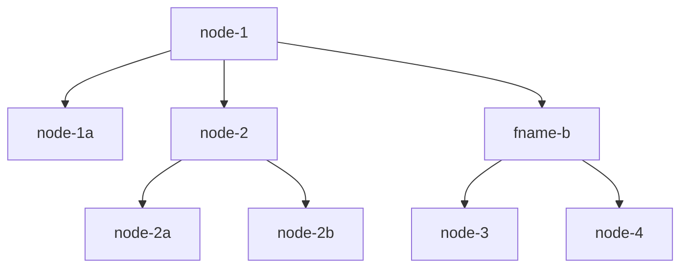

# semtree

[](https://github.com/wikibonsai/wikibonsai)
[](https://npmjs.org/package/semtree)

> “It is important to view knowledge as a sort of semantic tree. Make sure you understand the fundamental principles, i.e., the trunk and big branches before you get into the leaves/details or there is nothing for them to hang on to.”
> 
> ~ [Elon Musk](https://www.reddit.com/r/IAmA/comments/2rgsan/comment/cnfre0a/?utm_source=share&utm_medium=web2x&context=3)

`SemTree` is a utility to construct a semantic tree from  (word) lists/indexes which may span multiple objects, such as files. Can be used in conjunction with [[[wikirefs]]](https://github.com/wikibonsai/wikirefs) and [treehouze](https://github.com/wikibonsai/treehouze). See the [context](#context) for more details.

🌳 Cultivate a "semantic tree" or "knowledge bonsai" in your [🎋 WikiBonsai](https://github.com/wikibonsai/wikibonsai) digital garden.

## Install

Install with [npm](https://docs.npmjs.com/cli/v9/commands/npm-install):

```
npm install semtree
```

## Use

Say we have the following two markdown files:

```markdown
// file: fname-a

- [[node-1]]
  - [[node-1a]]
- [[node-2]]
  - [[node-2a]]
  - [[node-2b]]
- [[fname-b]]
```

```markdown
// file: fname-b

- [[node-3]]
- [[node-4]]
```

If we wanted to create a single tree from both of these files, we can use `semtree` like so:

```js
import * as semtree from 'semtree';

let opts = {
  wikitext: true, // defaults to 'true'
};
const rootName: string | undefined = 'fname-a';
// read in files and create a record where
// keys are filenames and values are the file's content
const semTreeText: Record<string, string> = {
  // key: filename; value: file content
  'fname-a':
`- [[node-1]]
  - [[node-1a]]
  - [[node-2]]
    - [[node-2a]]
      - [[node-2b]]
      - [[fname-b]]
`,
  'fname-b':
`- [[node-3]]
- [[node-4]]
`,
};
const tree = semtree.parse(semTreeText, rootName, opts);
```

Which will create a tree that looks like:



Each node in the tree contains:

```json
{
  "ancestors": [],
  "children": [],
  "text": "",
}
```

`ancestors`: An array of strings that are the text of other nodes in the tree. Represents ancestors of the current node from the root node following the ancestral path to the current node.

`children`: An array of strings that are the text of other nodes in the tree. Represents children of the current node.

`text`: Contains the node text, which should be unique across all nodes in the tree and is used as an identifier in each nodes' other properties `ancestors` and `children`.

⚠️ Note: Keep in mind preceeding newlines should be stripped from markdown content. For example:

```js
// 👍
const semTreeText: Record<string, string> = {
  // key: filename; value: file content
  'fname-a':
`- [[node-1]]
  - [[node-1a]]
  - [[node-2]]
`
};
```

```js
// 👎 error: the preceeding newlines will break parsing

const semTreeText: Record<string, string> = {
  // key: filename; value: file content
  'fname-a':
// 👇 these newlines will break parsing 👇
`

- [[node-1]]
  - [[node-1a]]
  - [[node-2]]
`
};
```

## Syntax and Validity

Parsing:
- The number of spaces that make up each level will be determined by the first indentation size -- this can be a number of spaces or a single tab. (Consider using a linter to help keep spacing sizes uniform).
- Bullets (`-*+`) are optional (see options).
- `[[wikitext]]` is optional (see `wikitext` option).

Valid Trees:
- Every node in the tree should be unique; e.g. each list-item's text should be unique.
- Must be a directed-acyclic-graph (DAG) (this happens naturally if you follow the former point).
- Each level can have any number of nodes.

Tree requirements are sparse because the idea is to allow the end-user to determine the shape of their tree in their markdown files. This package merely creates a single, virtual tree so as to better present that unified structure to the end-user.

### API

### `lint(content: string | Record<string, string>, lvlSize: number = -1): void | string`

Lint a file's content or a record of multiple files' file content.

Checks for:
  - Duplicates
  - Improper indenting
  - Over-indentation

#### Parameters

##### `content: string | Record<string, string>`

A content string or a `Record` whose keys are entities (such as files) and values are content strings of those entities.

##### `lvlSize: number = -1`

Number of spaces or tabs which represent each level in the tree.

### `parse(content: string | Record<string, string>, root?: string, opts?: SemTreeOpts): TreeNode[] | string;`

Parse a given file or files and build a tree from the filenames and their content. Will return a tree instance upon successful parse. Will return an error string otherwise, for example if there are duplicates found in the tree.

#### Parameters

##### `content: string | Record<string, string>`

A content string or a `Record` whose keys are entities (such as files) and values are content strings of those entities.

##### `root: string`

Name of the root node of the tree.

##### `opts: SemTreeOpts`

Options object -- see [options](#Options) below.

### `print(tree: SemTree, print: boolean = true): string | undefined`

Print the contents of a tree to console logs and return the string if there was a valid tree to print. Returns `undefined` if the tree is invalid.

Example output:

```
root
└── child
    ├── branch1
    |   ├── child1b
    |   └── branch2
    |       └── child2b
    └── grandchild
        └── greatgrandchild
```

#### Parameters

##### `tree: SemTree`

A tree object.

##### `print: boolean = true`

Seeing this to `false` will suppress printing the tree to the console log and just return the string representation.

### updateSubTree(tree: SemTree, content: string | Record<string, string>, subroot?: string, opts: SemTreeOpts = defaultOpts): TreeNode[] | string;`

A method to update a subtree within the semantic tree. (Best used to update individual `index` documents.) Returns the updated subtree nodes.

#### Parameters

##### `content: string | Record<string, string>`

A content string or a `Record` whose keys are entities (such as files) and values are content strings of those entities.

##### `subroot: string`

Name of the subroot node of the subtree to be replaced.

### semtree.clear()

Delete the local copy of the tree.

## Options

### `graft: (text: string, ancestors: string[]) => void`

A function to execute when each node is added to the tree.

### `lvlSize: number`

The size of each level in the tree -- corresponds to number of spaces or tabs.

### `mkdnList: boolean`

Whether `semtree` should expect file content to use markdown bullets `- `, `* `, or `+ `.

### `setRoot: (name: string) => void`

A function that can return/operate on the root name of the tree when it is being set.

### `virtualTrunk: boolean`

Whether or not to include the semtree/index files themselves as nodes in the tree. This option is a useful toggle between 'tree-building' (non-virtual to allow for index/trunk file traversal) and 'tree-viewing' (virtual to eliminate unnecessary index/trunk files) states. Default is `false`. Best used for things like static site generation where updates are not a usual occurrence.

Note: If `virtualTrunk` is set to `true`, it is wise to ensure there is a root-level node.

### `wikitext: boolean`

Whether or not to expect [[wikilink square brackets]] so they may be ignored when processing tree text. Default is `true`.

## Context

> A semantic tree wends through concepts in semantic space, like a melody winds through harmonies in music.

In [personal knowledge management (pkm)](https://en.wikipedia.org/wiki/Personal_knowledge_management) systems, there are sometimes mechanisms to facilitate the creation and management of hierarchical structures: [Tag hierarchies](https://orgmode.org/manual/Tag-Hierarchy.html) are fairly popular. Stitching together modular notes [together](https://tiddlywiki.com/static/Table-of-Contents%2520Macros.html) via [metadata](https://github.com/SkepticMystic/breadcrumbs) references is another solution. Some places are trying out [namespacing](https://github.com/wikibonsai/jekyll-namespaces). Even using the [directory system itself](https://github.com/xpgo/obsidian-folder-note-plugin) is being tried...And all the while, a [folgezettel debate](https://zettelkasten.de/folgezettel/) rages in the [zettelkasten](https://zettelkasten.de/) world.

But none of these solutions accommodate the specific aim of trying to build a "semantic tree well: Tag hierarchies and namespacing both suffer from branch length problems -- namespaces generally require the entire branch be spelled out to represent a node accurately, which restricts branch size and thus the size of the whole tree. Metadata pointers was better, but because relationships are built one by one between notes, making large changes to the tree itself is burdensome. Using the file directory itself runs into The Folder Problem, where using paths to represent branches would contain needless duplicates since directories stored no note information or clash with notes at the same level with the same name.

This implementation attempts to ameliorate these issues with the primary focus on facilitating semantic tree cultivation.

Side-Note: If you already have a collection of markdown notes, good candidates for index/tree(trunk) files might be "[zettelkasten hubs](https://zettelkasten.de/posts/zettelkasten-hubs/)" or "[maps of content](https://notes.linkingyourthinking.com/Cards/MOCs+Overview)" (will likely require some tweaking to fit the model required by this package).
